<p align="center">
  
  
  
  
  
</p>

# 🏠 Voice-First Aura Real Estate Agent (V-FAREA)

> **An edge-native, voice-first real estate pre-sales engine** that captures, qualifies, and converts premium buyer leads in real time — powered by **Gemini 3.5 Flash**, built with the **Google AI SDK**, and deployed on **Google Cloud Run**.

🔗 **Live Demo:** [voice-first-pre-sales-real-estate-ai-577822405739.asia-southeast1.run.app](https://voice-first-pre-sales-real-estate-ai-577822405739.asia-southeast1.run.app)

📍 **Built at:** [Agentic Premier League by Google — Hyderabad](https://gdg.community.dev/events/details/google-gdg-hyderabad-presents-agentic-premier-league-2/)

🔗 **GitHub:** [Voice-First-Aura-Real-Estate-Agent-V-FAREA](https://github.com/iammohith/Voice-First-Aura-Real-Estate-Agent-V-FAREA.git)

---

## 📌 Table of Contents

- [The Problem We Solve](#-the-problem-we-solve)
- [Key Features](#-key-features)
- [System Architecture](#-system-architecture)
  - [High-Level Overview](#high-level-overview)
  - [Component Dependency Graph](#component-dependency-graph)
  - [Deployment Topology](#deployment-topology)
- [Voice Pipeline — End-to-End Flow](#-voice-pipeline--end-to-end-flow)
- [Edge RAG — Context Retrieval Engine](#-edge-rag--context-retrieval-engine)
- [Lead Scoring Engine](#-lead-scoring-engine)
- [Guardrail System](#️-guardrail-system)
- [WhatsApp Omnichannel Handoff](#-whatsapp-omnichannel-handoff)
- [CFO Finance / Vastu / NRI FEMA Suite](#-cfo-finance--vastu--nri-fema-suite)
- [Tech Stack](#️-tech-stack)
- [Project Structure](#-project-structure)
- [Getting Started](#-getting-started)
- [API Reference](#-api-reference)
- [Supported Languages](#-supported-languages)
- [Featured Properties](#️-featured-properties)
- [Design Decisions & Trade-offs](#-design-decisions--trade-offs)
- [License](#-license)

---

## 🎯 The Problem We Solve

Most real estate platforms are **passive catalogs** with static contact forms. Premium real estate leads take **4–24 hours** to receive a callback, resulting in a **70% drop-off in buyer engagement**.

**V-FAREA transforms passive website traffic into hot, qualified leads** by replacing static forms with a responsive, voice-driven AI concierge that engages users **within 3 seconds** while they are still on the page.

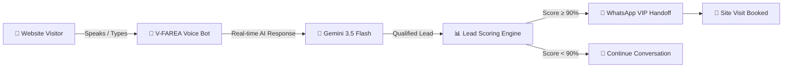

---

## 🚀 Key Features

### 🎤 Low-Latency Voice-Bot Widget
Engage with an intelligent agent via speech using browser-native Web Speech APIs. Supports real-time STT (Speech-to-Text) and TTS (Text-to-Speech) with automatic language detection and barge-in interruption.

### 📊 Real-Time Lead Scoring & Monitoring
A behavioural telemetry engine continuously scores buyer intent based on conversational signals — transaction intent, financial readiness, timeline urgency, Vastu interest, and NRI status. Dispatches `LeadHot` custom events when the score crosses the 90% threshold.

### 📐 CFO & Vastu Suite
- **CFO Finance Desk** — EMI breakdowns with SBI/HDFC rates (7.5%–11.0%), including Section 194-IA 1% TDS deductions for properties above ₹50 Lakh. State-specific stamp duty and GST calculations for Karnataka, Haryana, Telangana, and Maharashtra.
- **Vastu Compliance Scorer** — Entrance/kitchen orientation analysis with traditional remediation strategies and a 100-point celestial alignment scoring matrix.
- **NRI FEMA Desk** — FEMA compliance declarations, NRE/NRO/FCNR guidance, and repatriation eligibility checks.

### 📲 Automated WhatsApp VIP Handoff
Proactively dispatches RERA-compliant brochures and VIP calendar invites via the WhatsApp Business Cloud API when a lead crosses the high-commitment scoring threshold.

### 🛡️ RERA Compliance Guardrails
Client-side and server-side guardrails enforce price verification, mandatory RERA ID injection, PII scrubbing, and LLM self-evaluation artifact removal — ensuring every response is legally compliant and privacy-safe.

### 🌐 9-Language Multilingual Support
Full voice + text support for English, Hindi, Telugu, Tamil, Marathi, Bengali, Kannada, Gujarati, and Malayalam with auto-matching TTS voice selection.

### 🧠 Graceful Degradation
Dual-engine architecture: Gemini 3.5 Flash for production, with an intelligent rule-based fallback engine that provides high-fidelity offline responses for all 4 properties, including Telugu and Hindi.

---

## 🏗 System Architecture

### High-Level Overview

```mermaid
graph TB
    subgraph Client["🖥️ Browser Client — React 19 + Vite 6"]
        UI["App.tsx<br/>Main UI Shell"]
        VB["VoiceBotWidget<br/>Voice Conversation Interface"]
        PL["ProjectList<br/>Property Catalog Grid"]
        CFO["CfoVastuSuite<br/>Finance / Vastu / NRI Desk"]
        LAM["LeadActivityMonitor<br/>Real-time CRM Feed"]
        SVB["SiteVisitBooking<br/>VIP Tour Booking Modal"]

        subgraph ClientEngine["Client-Side Intelligence Layer"]
            STT["Web Speech API<br/>Speech-to-Text"]
            TTS["Speech Synthesis<br/>Text-to-Speech"]
            LS["LeadScorer<br/>5-Dimension Intent Analysis"]
            GR["Guardrails<br/>Price / PII / RERA Pipeline"]
            RAG_C["retrieveContext()<br/>Edge RAG — Keyword Scoring"]
            WH["useWhatsAppHandoff<br/>LeadHot Event Listener"]
            VE["useVoiceEngine<br/>STT + TTS Orchestration"]
        end
    end

    subgraph Server["⚙️ Express + Vite Server — server.ts"]
        CHAT["/api/chat<br/>Conversational AI Endpoint"]
        BOOK["/api/booking/create<br/>Lead Capture Endpoint"]
        WA["/api/whatsapp-handoff<br/>Omnichannel Webhook"]
        HEALTH["/api/health<br/>Liveness Probe"]
        BOOKGET["/api/bookings<br/>Lead List Retrieval"]

        subgraph AI["🧠 AI Layer"]
            GEMINI["Gemini 3.5 Flash<br/>@google/genai SDK"]
            SYS["System Instruction<br/>Pre-Sales Persona + Mandates"]
            RAGCTX["RAG Context Overlay<br/>RERA Grounding Facts"]
            FALLBACK["Rule-Based Fallback Engine<br/>getRuleFallback()"]
        end

        subgraph Services["📦 Services"]
            WASERVICE["WhatsAppService<br/>Meta Cloud API + Simulation"]
        end

        STORE["In-Memory Store<br/>BookingLead[]"]
    end

    subgraph Deploy["☁️ Google Cloud Run"]
        GCR["asia-southeast1<br/>Container Runtime"]
    end

    UI --> VB
    UI --> PL
    UI --> CFO
    UI --> LAM
    UI --> SVB
    VB --> VE
    VB --> STT
    VB --> TTS
    VB --> LS
    VB --> GR
    VB --> RAG_C
    VB --> WH

    VB -->|"POST /api/chat"| CHAT
    SVB -->|"POST /api/booking/create"| BOOK
    WH -->|"POST /api/whatsapp-handoff"| WA
    LAM -->|"GET /api/bookings"| BOOKGET

    CHAT --> GEMINI
    CHAT --> RAGCTX
    CHAT --> FALLBACK
    GEMINI --> SYS
    WA --> WASERVICE
    BOOK --> STORE
    BOOKGET --> STORE

    Server --> Deploy

    style Client fill:#0d1117,stroke:#30363d,color:#c9d1d9
    style Server fill:#0d1117,stroke:#30363d,color:#c9d1d9
    style AI fill:#1a1f2e,stroke:#3b82f6,color:#93c5fd
    style ClientEngine fill:#1a1f2e,stroke:#f59e0b,color:#fcd34d
    style Deploy fill:#0d1117,stroke:#10b981,color:#6ee7b7
    style Services fill:#1a1f2e,stroke:#8b5cf6,color:#c4b5fd
```

### Component Dependency Graph

This diagram shows the precise import relationships between all source modules:

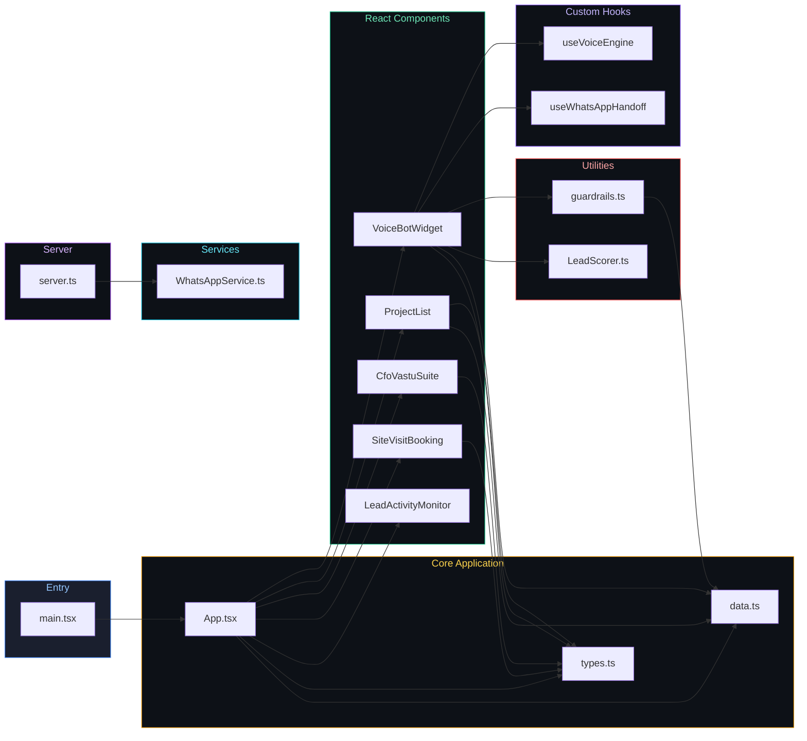

### Deployment Topology

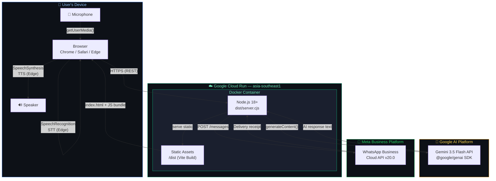

---

## 🎤 Voice Pipeline — End-to-End Flow

The voice pipeline orchestrates the full conversation loop from microphone input to AI-generated spoken response, including edge RAG retrieval, lead scoring, guardrail auditing, and booking intent classification:

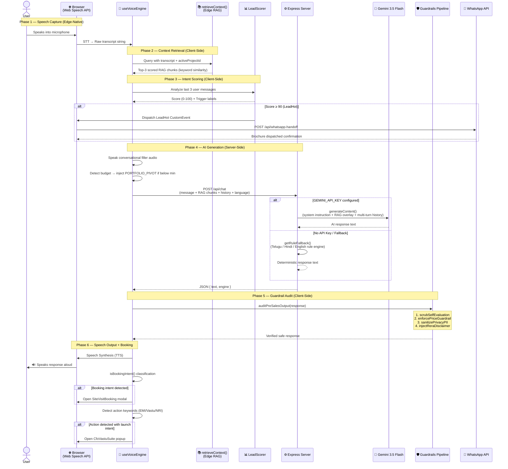

---

## 📚 Edge RAG — Context Retrieval Engine

The `retrieveContext()` function implements a lightweight, **zero-latency keyword-scoring retrieval engine** that runs entirely on the client side. It eliminates the need for a vector database by using a hand-crafted knowledge base of 30+ RERA-grounded chunks:

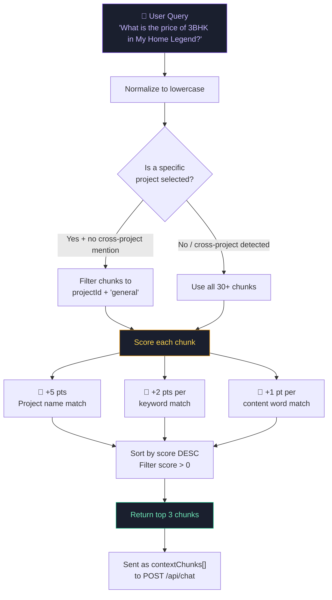

**RAG Chunk Categories:**

| Category | Count | Examples |
|----------|-------|---------|
| `pricing` | 4 | Unit configs, carpet areas, price ranges |
| `rera` | 4 | Registration numbers, compliance status |
| `possession` | 4 | Timeline, construction stage |
| `location` | 3 | Connectivity, metro distance, landmarks |
| `amenities` | 3 | Clubhouse, pool, EV charging |
| `general` | 15+ | Vastu, NRI FEMA, legal docs, stamp duty, EMI |

---

## 📊 Lead Scoring Engine

The `LeadScorer` performs real-time buyer intent analysis across **five weighted dimensions** with compounding phrase-level weights. Scores are computed client-side in microseconds on every user utterance:

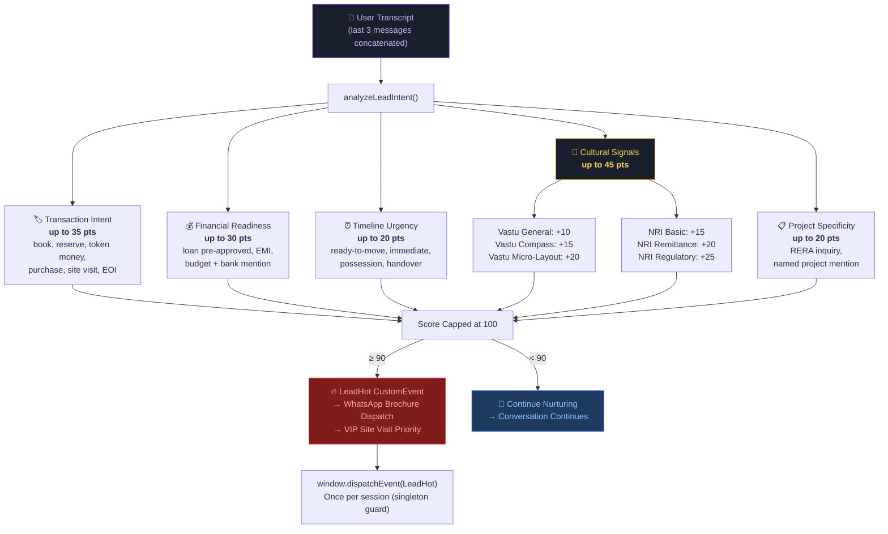

**Scoring Behavior:**

- Scores are **compounding** — a user mentioning "book a site visit for the NRI FEMA-compliant east-facing 3BHK" would trigger Transaction + NRI + Vastu + Project dimensions simultaneously.
- The `LeadHot` event fires **exactly once per session** (singleton guard via module-level `leadHotDispatched` flag).
- The scoring function also detects **budget tier** (`Crore-Tier` / `Lakh-Tier`) for analytics segmentation.

---

## 🛡️ Guardrail System

The `auditPreSalesOutput()` pipeline ensures every AI response is RERA-compliant, factually grounded, and privacy-safe before reaching the user. It runs **client-side** as a post-processing filter:

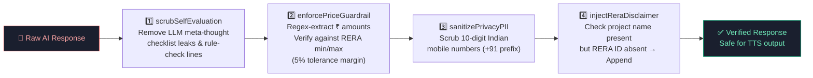

| Guardrail | Detection Method | Action | Module |
|-----------|-----------------|--------|--------|
| **Self-Eval Scrub** | Regex for LLM checklist/compliance leak patterns (`"3-6 sentences? Yes"`, `"Rule check:"`) | Strip leaked meta-thought lines | `scrubSelfEvaluationArtifacts()` |
| **Price Verification** | Regex extraction of ₹ amounts → verify against `numericPriceMin`/`numericPriceMax` per unit config, 5% tolerance | Rewrite to "refer to official RERA price list" | `enforcePriceGuardrail()` |
| **PII Scrubbing** | Regex for 10-digit Indian mobile numbers (`/(?:\+91[\-\s]?)?[789]\d{9}\b/g`) | Replace with `[PHONE NUMBER SCRUBBED FOR PRIVACY]` | `sanitizePrivacyPII()` |
| **RERA Injection** | String matching: project name present but RERA ID absent | Append `(RERA Reg: XXXX)` before final period | `injectReraDisclaimer()` |

---

## 📲 WhatsApp Omnichannel Handoff

When a lead reaches high-commitment status (score ≥ 90), the system automatically triggers a WhatsApp omnichannel handoff through a multi-layer pipeline:

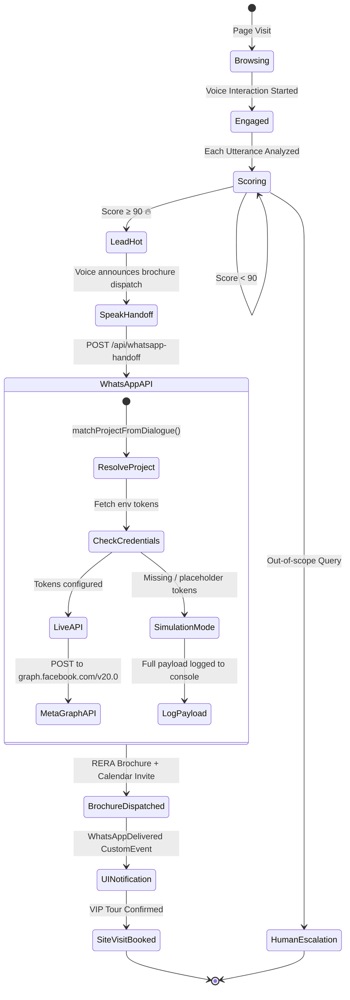

**WhatsApp Service Architecture:**

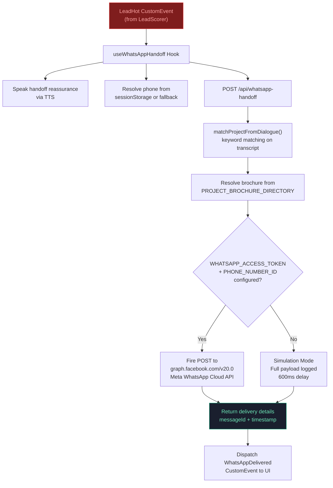

---

## 📐 CFO Finance / Vastu / NRI FEMA Suite

The `CfoVastuSuite` component implements three interactive enterprise decision tools as tabbed interfaces:

```mermaid
graph TD
    subgraph FinanceTab["💰 CFO Finance Desk"]
        F1["Select Unit Configuration"] --> F2["Fine-tune Property Value<br/>(range slider)"]
        F2 --> F3["Adjust Downpayment %<br/>Tenure Years<br/>Interest Rate"]
        F3 --> F4["EMI = P × r × (1+r)^n / ((1+r)^n - 1)"]
        F4 --> F5["State-Specific Taxes<br/>Karnataka: 5.1% SD + 1% Reg<br/>Haryana: 7% SD + 1% Reg<br/>Telangana: 5.5% SD + 0.5% Reg<br/>Maharashtra: 6% SD + 1% Reg"]
        F5 --> F6["Section 194-IA<br/>1% TDS if ≥ ₹50L"]
        F6 --> F7["Total Acquisition Estimate"]
    end

    subgraph VastuTab["🧭 Vastu Shastra Engine"]
        V1["Select Entrance Direction<br/>(6 options)"] --> V2["Select Kitchen Placement<br/>(4 options)"]
        V2 --> V3["Compute Vastu Score<br/>(0-100)"]
        V3 --> V4{"Score ≥ 90?"}
        V4 -->|"Yes"| V5["✅ Celestial Alignment Match"]
        V4 -->|"60-89"| V6["⚠️ Compliant Layout"]
        V4 -->|"< 60"| V7["❌ Remediation Required"]
    end

    subgraph NriTab["🌐 NRI FEMA Desk"]
        N1["Toggle NRI Flag"] --> N2["Select Remittance Account<br/>NRE / NRO / Direct Inward"]
        N2 --> N3["FEMA Eligibility Check"]
        N3 --> N4["Repatriation Rules<br/>Max 2 properties<br/>NRO 15CA/15CB forms"]
    end

    style FinanceTab fill:#0d1117,stroke:#3b82f6,color:#93c5fd
    style VastuTab fill:#0d1117,stroke:#f59e0b,color:#fcd34d
    style NriTab fill:#0d1117,stroke:#10b981,color:#6ee7b7
```

---

## 🛠️ Tech Stack

| Layer | Technology | Purpose |
|-------|-----------|---------|
| **Frontend** | React 19 + TypeScript | SPA with hooks-based state management |
| **Styling** | Tailwind CSS 4 + Lucide Icons | Utility-first CSS with icon library |
| **Animation** | Motion (Framer Motion) | Message transitions, pulse effects |
| **Backend** | Express 4 + TypeScript (tsx) | API routes + Vite middleware integration |
| **AI Model** | Gemini 3.5 Flash (`@google/genai`) | Conversational AI with system instructions |
| **Voice** | Web Speech API (native browser) | Edge-native STT/TTS — zero-latency, privacy-safe |
| **RAG** | Custom keyword scorer (`data.ts`) | 30+ hand-crafted RERA grounding chunks |
| **Build** | Vite 6 (client) + esbuild (server → `dist/server.cjs`) | HMR dev + optimized production builds |
| **Deployment** | Google Cloud Run (asia-southeast1) | Serverless container auto-scaling |
| **Linting** | TypeScript strict mode (`tsc --noEmit`) | Compile-time type safety |

---

## 📁 Project Structure

```
voice-first-pre-sales-real-estate-ai/
├── server.ts                          # Express backend — API routes + Gemini integration + rule fallback engine
├── index.html                         # Vite entry HTML
├── package.json                       # Dependencies & scripts (React 19, Gemini SDK, Express, Motion)
├── tsconfig.json                      # TypeScript configuration (ES2022, bundler resolution, JSX)
├── vite.config.ts                     # Vite bundler config (React + Tailwind plugins, HMR toggle)
├── metadata.json                      # AI Studio deployment metadata (microphone permission)
├── .env.example                       # Environment variable template (GEMINI_API_KEY, APP_URL)
├── .gitignore
├── LICENSE                            # MIT License — Mohith Sai Gorla
│
├── src/
│   ├── main.tsx                       # React entry point (StrictMode + createRoot)
│   ├── App.tsx                        # Main application shell — layout grid, modals, routing state
│   ├── index.css                      # Global Tailwind import
│   ├── types.ts                       # TypeScript interfaces (Project, UnitConfig, Message, BookingSession)
│   ├── data.ts                        # RERA-grounded property data (4 projects) + 30+ RAG chunks + retrieveContext()
│   │
│   ├── components/
│   │   ├── VoiceBotWidget.tsx         # 🎤 Voice conversation interface — STT/TTS, RAG, lead scoring, booking detection
│   │   ├── ProjectList.tsx            # 🏢 Filterable property catalog grid with region badges
│   │   ├── CfoVastuSuite.tsx          # 📐 EMI calculator / Vastu scorer / NRI FEMA desk (3-tab suite)
│   │   ├── SiteVisitBooking.tsx       # 📅 VIP site visit booking form modal with server-side persistence
│   │   └── LeadActivityMonitor.tsx    # 📊 Real-time CRM lead feed with polling refresh
│   │
│   ├── hooks/
│   │   ├── useVoiceEngine.ts          # 🔊 STT/TTS orchestration hook — language switching, barge-in, voice selection
│   │   └── useWhatsAppHandoff.ts      # 📲 LeadHot event listener → WhatsApp brochure dispatch webhook
│   │
│   ├── utils/
│   │   ├── guardrails.ts             # 🛡️ 4-stage guardrail pipeline (self-eval scrub, price, PII, RERA)
│   │   └── LeadScorer.ts             # 📊 5-dimension buyer intent scoring engine with LeadHot event dispatch
│   │
│   └── services/
│       └── WhatsAppService.ts         # 📲 Meta WhatsApp Business Cloud API integration + simulation fallback
│
├── functions/
│   └── index.js                       # Cloud Functions entry (if applicable)
│
└── assets/                            # Static assets directory
```

---

## 🚀 Getting Started

### Prerequisites
- **Node.js 18+** (LTS recommended)
- A **Gemini API key** from [Google AI Studio](https://aistudio.google.com/) (optional — the app includes a rule-based fallback engine for offline usage)

### Installation

```bash
# Clone the repository
git clone https://github.com/iammohith/Voice-First-Aura-Real-Estate-Agent-V-FAREA.git
cd Voice-First-Aura-Real-Estate-Agent-V-FAREA

# Install dependencies
npm install

# Set up environment variables
cp .env.example .env
# Edit .env and add your GEMINI_API_KEY
```

### Running Locally

```bash
# Development server (with hot reload via tsx + Vite middleware)
npm run dev

# Production build (Vite client + esbuild server bundle)
npm run build

# Start production server
npm start
```

The app will be available at `http://localhost:3000`.

### Environment Variables

| Variable | Required | Description |
|----------|----------|-------------|
| `GEMINI_API_KEY` | Optional | Google Gemini API key. Falls back to rule engine if missing. |
| `APP_URL` | Optional | Deployment URL (auto-injected by Cloud Run / AI Studio). |
| `WHATSAPP_ACCESS_TOKEN` | Optional | Meta WhatsApp Business API token for live dispatch. |
| `WHATSAPP_PHONE_NUMBER_ID` | Optional | Meta phone number ID for WhatsApp Cloud API. |
| `WHATSAPP_TEMPLATE_NAME` | Optional | Pre-approved template name (default: `signature_estates_presales_brochure`). |

---

## 📡 API Reference

### `GET /api/health`
Server health check + API key status.

**Response:**
```json
{ "status": "healthy", "keyConfigured": true }
```

---

### `POST /api/chat`
Conversational AI endpoint with multi-turn history, edge RAG context overlay, and dual-engine support.

**Request:**
```json
{
  "message": "What is the price of 3BHK in My Home Legend Hyderabad?",
  "contextChunks": ["My Home Legend Kokapet: 3BHK Sky Villa ₹2.90 Cr - ₹3.15 Cr..."],
  "history": [
    { "sender": "user", "text": "Hello" },
    { "sender": "assistant", "text": "Welcome! How can I help?" }
  ],
  "activeLanguage": "en-IN"
}
```

**Response:**
```json
{
  "text": "My Home Legend in Kokapet offers luxury 3 BHK units at ₹2.90 Crores...",
  "engine": "gemini-3.5-flash"
}
```

**Server Processing:**
1. Constructs RERA grounding context overlay from `contextChunks`
2. Builds Gemini-compatible multi-turn `contents` payload (role alternation enforced)
3. If API key is configured: calls `ai.models.generateContent()` with `temperature: 0.3`, `maxOutputTokens: 750`
4. If no API key: routes to `getRuleFallback()` — supports English, Hindi, Telugu

---

### `POST /api/booking/create`
Register a VIP site visit lead.

**Request:**
```json
{
  "name": "Anand Murthy",
  "phone": "9845012345",
  "email": "anand@outlook.in",
  "projectId": "myhome-legend",
  "projectName": "My Home Legend",
  "preferredDate": "2026-06-07",
  "preferredTime": "10:00 AM - 12:00 PM"
}
```

**Response:**
```json
{
  "success": true,
  "booking": { "id": "book_1717100000000", "name": "Anand Murthy", "..." },
  "message": "Thank you Anand Murthy! Your VIP site visit to My Home Legend has been registered."
}
```

---

### `GET /api/bookings`
Retrieve all captured leads (in-memory store).

**Response:**
```json
{ "bookings": [{ "id": "book_...", "name": "...", "..." }] }
```

---

### `POST /api/whatsapp-handoff`
Trigger WhatsApp brochure dispatch via Meta Cloud API (or simulation).

**Request:**
```json
{
  "score": 95,
  "triggers": ["DIRECT_TRANSACTION_INTENT", "NRI_BASIC_STATUS"],
  "transcript": "I want to book My Home Legend",
  "budgetDetected": "Crore-Tier",
  "phone": "919845012345"
}
```

**Response:**
```json
{
  "success": true,
  "dispatched": true,
  "simulated": true,
  "deliveryDetails": {
    "timestamp": "2026-06-02T11:30:00.000Z",
    "phoneNumber": "919845012345",
    "mediaLink": "https://signature-estates.ai/docs/my-home-legend-brochure.pdf",
    "projectDispatched": "My Home Legend"
  }
}
```

---

## 🌐 Supported Languages

The voice bot supports multilingual conversations with automatic language detection and matching TTS voice selection:

| Language | Code | STT | TTS | AI Response | Rule Fallback | Script Detection |
|----------|------|-----|-----|-------------|---------------|------------------|
| English | `en-IN` | ✅ | ✅ | ✅ | ✅ Full | — |
| Hindi (हिन्दी) | `hi-IN` | ✅ | ✅ | ✅ | ✅ Full | `[\u0900-\u097F]` |
| Telugu (తెలుగు) | `te-IN` | ✅ | ✅ | ✅ | ✅ Full | `[\u0C00-\u0C7F]` |
| Tamil (தமிழ்) | `ta-IN` | ✅ | ✅ | ✅ | ⚠️ Partial | — |
| Marathi (मराठी) | `mr-IN` | ✅ | ✅ | ✅ | ⚠️ Partial | — |
| Bengali (বাংলা) | `bn-IN` | ✅ | ✅ | ⚠️ | ⚠️ Partial | — |
| Kannada (ಕನ್ನಡ) | `kn-IN` | ✅ | ✅ | ⚠️ | 🔜 Planned | — |
| Gujarati (ગુજરાતી) | `gu-IN` | ✅ | ✅ | ⚠️ | 🔜 Planned | — |
| Malayalam (മലയാളം) | `ml-IN` | ✅ | ✅ | ⚠️ | 🔜 Planned | — |

---

## 🏗️ Featured Properties

The platform showcases four RERA-approved premium developments with complete grounding data:

| Property | Developer | Location | Price Range | RERA ID | Possession |
|----------|-----------|----------|-------------|---------|------------|
| **Prestige Solitaire** | Prestige Group | Whitefield, Bengaluru | ₹1.45 Cr – ₹3.40 Cr | PRM/KA/RERA/1251/... | Dec 2028 |
| **DLF Horizon** | DLF Group | Sector 65, Gurugram | ₹3.80 Cr – ₹9.00 Cr | RC/REP/HARERA/GGM/... | Oct 2029 |
| **Lodha Splendora Marina** | Lodha Group | Thane West, Mumbai | ₹85 L – ₹2.10 Cr | P51700021432 | Ready to Move |
| **My Home Legend** | My Home Constructions | Kokapet, Hyderabad | ₹2.90 Cr – ₹8.30 Cr | P02400007821 | Mar 2029 |

---

## 🧩 Design Decisions & Trade-offs

### Why Edge RAG instead of a Vector Database?
The knowledge base is curated and bounded (4 properties × 6 categories + 15 general chunks). A keyword-scoring approach delivers **zero-latency context retrieval** with no external dependencies, which is ideal for a voice-first UX where every millisecond of latency degrades the user experience. This trades off semantic generalization for deterministic, auditable grounding.

### Why Client-Side Guardrails?
Running guardrails on the client ensures the pipeline works identically in both Gemini and fallback modes. It also prevents RERA-violating content from ever reaching TTS — even if the server returns a problematic response due to prompt injection or model drift.

### Why Browser-Native STT/TTS instead of Cloud APIs?
Using Web Speech API keeps voice processing **entirely on-device**, which:
1. Eliminates audio streaming latency to cloud ASR services
2. Maintains DPDPA (Digital Personal Data Protection Act) compliance by keeping private voice data on the user's device
3. Removes recurring API costs for speech services

The trade-off is browser compatibility variations — mitigated by a text input fallback that's always available.

### Why an In-Memory Booking Store?
For a hackathon-scoped demo, an in-memory `BookingLead[]` array avoids database setup complexity. In production, this would be replaced with a persistent store (Firestore, PostgreSQL, etc.).

### Why Dual-Engine Architecture?
The rule-based fallback engine (`getRuleFallback()`) ensures the application is **fully functional without any API key**, which is critical for:
1. Offline demo scenarios at hackathons
2. CI/CD pipeline testing
3. Rate-limited or quota-exhausted API keys

---

## 📄 License

This project is licensed under the [MIT License](LICENSE).

---

<p align="center">
  Built with ❤️ by <strong>Mohith Sai Gorla</strong> at <strong>Agentic Premier League by Google, Hyderabad</strong><br/>
  Powered by <strong>Gemini 3.5 Flash</strong> &amp; <strong>Google AI SDK</strong>
</p>
