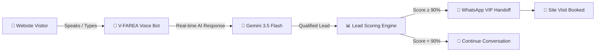
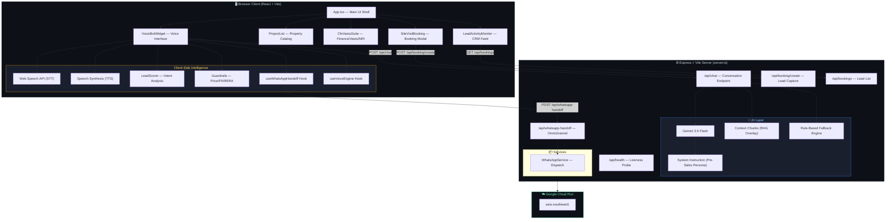
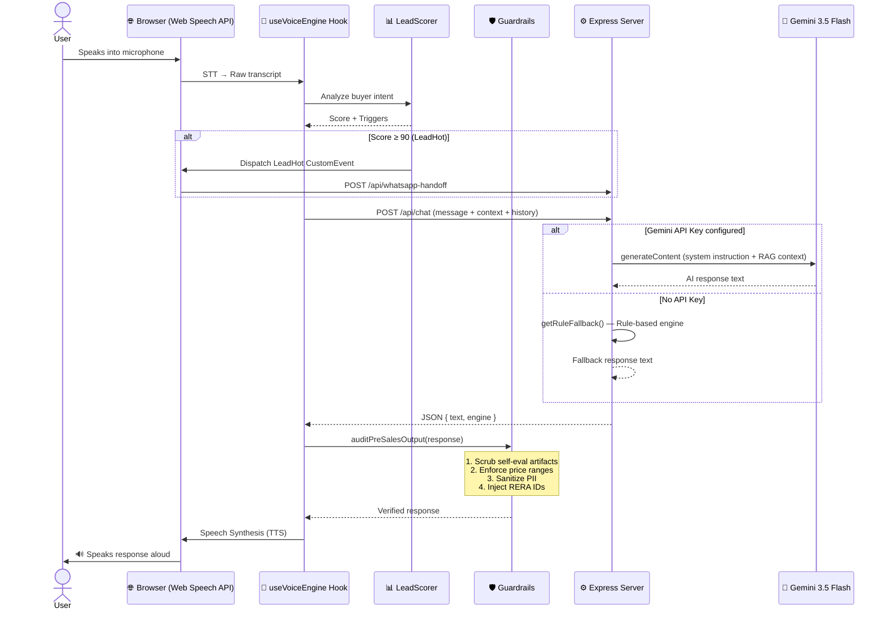
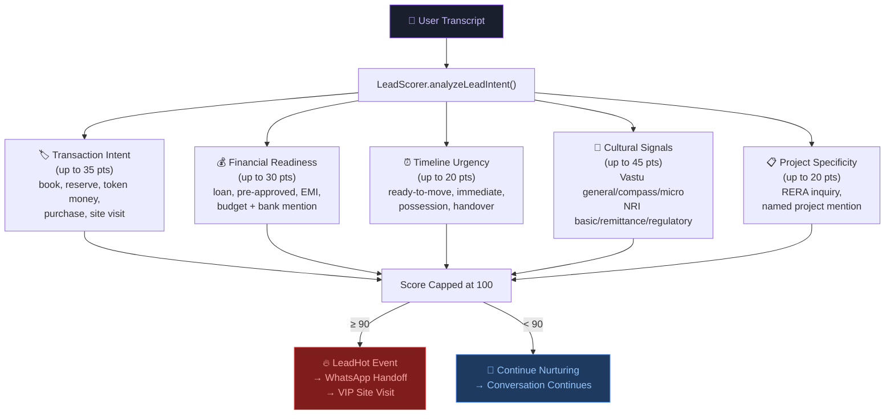
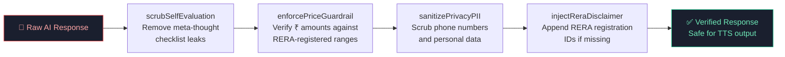
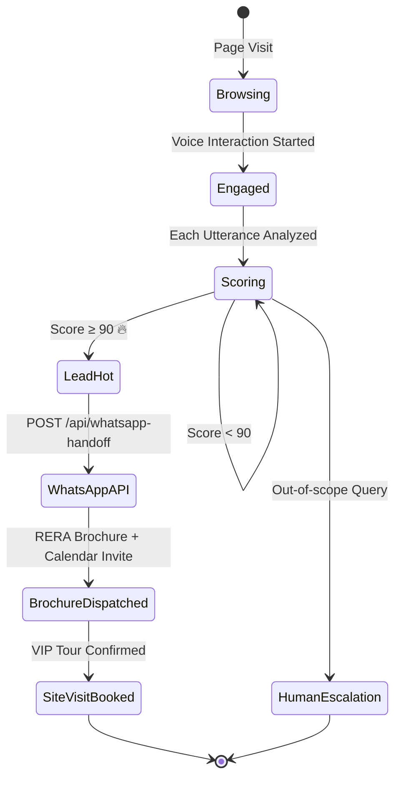

# 🏠 Voice-First Aura Real Estate Agent (V-FAREA)

> **An edge-native, voice-first real estate pre-sales engine** designed to capture, qualify, and convert premium leads in real time — powered by **Gemini 3.5 Flash** and built with the Google AI SDK.

🔗 **Live Demo:** [voice-first-pre-sales-real-estate-ai-577822405739.asia-southeast1.run.app](https://voice-first-pre-sales-real-estate-ai-577822405739.asia-southeast1.run.app)

📍 **Built at:** [Agentic Premier League by Google — Hyderabad](https://rsvp.withgoogle.com/events/agentic-premier-league)

---

## 📌 Table of Contents

- [Overview](#-overview)
- [Key Features](#-key-features)
- [System Architecture](#-system-architecture)
- [Voice Pipeline](#-voice-pipeline)
- [Lead Scoring Engine](#-lead-scoring-engine)
- [Guardrail System](#-guardrail-system)
- [WhatsApp Handoff Flow](#-whatsapp-handoff-flow)
- [Tech Stack](#️-tech-stack)
- [Project Structure](#-project-structure)
- [Getting Started](#-getting-started)
- [API Endpoints](#-api-endpoints)
- [Supported Languages](#-supported-languages)
- [License](#-license)

---

## 🌟 Overview

Most real estate platforms are passive catalogs with static contact forms. **V-FAREA transforms passive website traffic into hot, qualified leads** by replacing forms with a responsive, voice-driven AI concierge that speaks in English, Hindi, Telugu, Tamil, and more.

**The core problem we solve:** Premium real estate leads take **4–24 hours** to receive a callback, resulting in a **70% drop in engagement**. V-FAREA engages users **within 3 seconds** while they are still on the page.



---

## 🚀 Key Features

### 🎤 Low-Latency Voice-Bot Widget
Engage with an intelligent agent via speech using browser-native Web Speech APIs. Supports real-time STT (Speech-to-Text) and TTS (Text-to-Speech) with automatic language detection.

### 📊 Real-Time Lead Scoring & Monitoring
A behavioural telemetry engine continuously scores buyer intent based on conversational signals — transaction intent, financial readiness, timeline urgency, Vastu interest, and NRI status. Triggers `LeadHot` events when score crosses 90%.

### 📐 CFO & Vastu Suite
- **CFO Finance Desk** — EMI breakdowns with SBI/HDFC rates (7.5%–11.0%), including Section 194-IA 1% TDS deductions for properties above ₹50 Lakh.
- **Vastu Compliance Scorer** — Entrance/kitchen orientation analysis with traditional remediation strategies.
- **NRI FEMA Desk** — FEMA compliance declarations, NRE/NRO guidance, and repatriation checks.

### 📲 Automated WhatsApp VIP Handoff
Proactively dispatches RERA-compliant brochures and VIP calendar invites via WhatsApp when a lead crosses the high-commitment scoring threshold.

### 🛡️ RERA Compliance Guardrails
Client-side and server-side guardrails that enforce price verification, mandatory RERA ID injection, PII scrubbing, and self-evaluation artifact removal.

---

## 🏗 System Architecture

### High-Level Overview



---

## 🎤 Voice Pipeline

The voice pipeline orchestrates the full conversation loop from microphone input to AI-generated spoken response:



---

## 📊 Lead Scoring Engine

The `LeadScorer` performs real-time buyer intent analysis across five dimensions with compounding weights:



---

## 🛡️ Guardrail System

The `auditPreSalesOutput` pipeline ensures every AI response is RERA-compliant, factually grounded, and privacy-safe:



| Guardrail | Detection Method | Action |
|-----------|-----------------|--------|
| **Price Verification** | Regex extraction of ₹ amounts → verify against `numericPriceMin`/`numericPriceMax` per unit config | Rewrite to "refer to official RERA price list" |
| **PII Scrubbing** | Regex for 10-digit Indian mobile numbers (+91 prefix) | Replace with `[PHONE NUMBER SCRUBBED]` |
| **RERA Injection** | Check if project name present but RERA ID absent | Append `(RERA Reg: XXXX)` |
| **Self-Eval Scrub** | Pattern matching for LLM checklist/compliance leaks | Strip leaked meta-thought lines |

---

## 📲 WhatsApp Handoff Flow

When a lead reaches high-commitment status, the system automatically triggers a WhatsApp omnichannel handoff:



---

## 🛠️ Tech Stack

| Layer | Technology |
|-------|-----------|
| **Frontend** | React 19 + TypeScript + Vite 6 |
| **Styling** | Tailwind CSS 4 + Lucide Icons |
| **Animation** | Motion (Framer Motion) |
| **Backend** | Express 4 + TypeScript (tsx) |
| **AI Model** | Gemini 3.5 Flash (`@google/genai`) |
| **Voice** | Web Speech API (native browser STT/TTS) |
| **Build** | Vite (client) + esbuild (server → `dist/server.cjs`) |
| **Deployment** | Google Cloud Run (asia-southeast1) |
| **Linting** | TypeScript strict mode (`tsc --noEmit`) |

---

## 📁 Project Structure

```
voice-first-pre-sales-real-estate-ai/
├── server.ts                          # Express backend — API routes + Gemini integration
├── index.html                         # Vite entry HTML
├── package.json                       # Dependencies & scripts
├── tsconfig.json                      # TypeScript configuration
├── vite.config.ts                     # Vite bundler configuration
├── .env.example                       # Environment variable template
├── .gitignore
├── LICENSE
│
├── src/
│   ├── main.tsx                       # React entry point
│   ├── App.tsx                        # Main application shell & layout
│   ├── index.css                      # Global styles
│   ├── types.ts                       # TypeScript interfaces (Project, Message, etc.)
│   ├── data.ts                        # RERA-grounded property data (4 premium projects)
│   │
│   ├── components/
│   │   ├── VoiceBotWidget.tsx         # 🎤 Voice conversation interface
│   │   ├── ProjectList.tsx            # 🏢 Property catalog grid
│   │   ├── CfoVastuSuite.tsx          # 📐 EMI calculator / Vastu / NRI desk
│   │   ├── SiteVisitBooking.tsx       # 📅 VIP site visit booking modal
│   │   └── LeadActivityMonitor.tsx    # 📊 Real-time lead CRM feed
│   │
│   ├── hooks/
│   │   ├── useVoiceEngine.ts          # 🔊 STT/TTS orchestration hook
│   │   └── useWhatsAppHandoff.ts      # 📲 WhatsApp dispatch hook
│   │
│   ├── utils/
│   │   ├── guardrails.ts             # 🛡️ Price/PII/RERA guardrail pipeline
│   │   └── LeadScorer.ts             # 📊 Buyer intent scoring engine
│   │
│   └── services/
│       └── WhatsAppService.ts         # 📲 WhatsApp Business API integration
│
├── functions/
│   └── index.js                       # Cloud Functions (if applicable)
│
└── assets/                            # Static assets
```

---

## 🚀 Getting Started

### Prerequisites
- Node.js 18+
- A Gemini API key (optional — the app includes a rule-based fallback engine for offline usage)

### Installation

```bash
# Clone the repository
git clone git@github.com:iammohith/Voice-First-Aura-Real-Estate-Agent-V-FAREA.git
cd Voice-First-Aura-Real-Estate-Agent-V-FAREA

# Install dependencies
npm install

# Set up environment variables
cp .env.example .env
# Edit .env and add your GEMINI_API_KEY
```

### Running Locally

```bash
# Development server (with hot reload)
npm run dev

# Production build
npm run build

# Start production server
npm start
```

The app will be available at `http://localhost:3000`.

---

## 📡 API Endpoints

| Method | Path | Auth | Description |
|--------|------|------|-------------|
| `GET` | `/api/health` | None | Server health check + API key status |
| `POST` | `/api/chat` | None | Conversational AI endpoint (Gemini + RAG context) |
| `POST` | `/api/booking/create` | None | Register a VIP site visit lead |
| `GET` | `/api/bookings` | None | Retrieve all captured leads |
| `POST` | `/api/whatsapp-handoff` | None | Trigger WhatsApp brochure dispatch |

### Chat Request Example

```json
{
  "message": "What is the price of 3BHK in My Home Legend Hyderabad?",
  "contextChunks": ["My Home Legend Kokapet: 3BHK Sky Villa ₹2.90 Cr - ₹3.15 Cr..."],
  "history": [
    { "sender": "user", "text": "Hello" },
    { "sender": "assistant", "text": "Welcome! How can I help?" }
  ],
  "activeLanguage": "en-IN"
}
```

---

## 🌐 Supported Languages

The voice bot supports multilingual conversations with automatic language detection:

| Language | STT | TTS | AI Response | Code-Switch |
|----------|-----|-----|-------------|-------------|
| English | ✅ | ✅ | ✅ | Source |
| Hindi (हिन्दी) | ✅ | ✅ | ✅ | Full |
| Telugu (తెలుగు) | ✅ | ✅ | ✅ | Full |
| Tamil (தமிழ்) | ✅ | ✅ | ✅ | Partial |
| Marathi (मराठी) | ✅ | ✅ | ✅ | Partial |
| Bengali (বাংলা) | ✅ | ✅ | ⚠️ | Partial |
| Kannada (ಕನ್ನಡ) | ✅ | ✅ | ⚠️ | Planned |
| Gujarati (ગુજરાતી) | ✅ | ✅ | ⚠️ | Planned |
| Malayalam (മലയാളം) | ✅ | ✅ | ⚠️ | Planned |

---

## 🏗️ Featured Properties

The platform showcases four RERA-approved premium developments:

| Property | Developer | Location | Price Range | RERA ID |
|----------|-----------|----------|-------------|---------|
| **Prestige Solitaire** | Prestige Group | Whitefield, Bengaluru | ₹1.45 Cr – ₹3.40 Cr | PRM/KA/RERA/1251/... |
| **DLF Horizon** | DLF Group | Sector 65, Gurugram | ₹3.80 Cr – ₹9.00 Cr | RC/REP/HARERA/GGM/... |
| **Lodha Splendora Marina** | Lodha Group | Thane West, Mumbai | ₹85 L – ₹2.10 Cr | P51700021432 |
| **My Home Legend** | My Home Constructions | Kokapet, Hyderabad | ₹2.90 Cr – ₹8.30 Cr | P02400007821 |

---

## 📄 License

This project is licensed under the [MIT License](LICENSE).

---

<p align="center">
  Built with ❤️ at <strong>Agentic Premier League by Google, Hyderabad</strong><br/>
  Powered by <strong>Gemini 3.5 Flash</strong> &amp; <strong>Google AI SDK</strong>
</p>
