<p align="center">
  
  
  
  
  
</p>

# 🏠 Voice-First Aura Real Estate Agent (V-FAREA)

> **An edge-native, voice-first real estate pre-sales engine** that captures, qualifies, and converts premium buyer leads in real time — powered by **Gemini 3.5 Flash** and **Gemini 3.1 Flash TTS**, built with the **Google AI SDK**, and deployed on **Google Cloud Run**.

🔗 **Live Demo:** [voice-first-pre-sales-real-estate-ai-577822405739.asia-southeast1.run.app](https://voice-first-pre-sales-real-estate-ai-577822405739.asia-southeast1.run.app)

📍 **Built at:** [Agentic Premier League by Google — Hyderabad](https://gdg.community.dev/events/details/google-gdg-hyderabad-presents-agentic-premier-league-2/)

🔗 **GitHub:** [Voice-First-Aura-Real-Estate-Agent-V-FAREA](https://github.com/iammohith/Voice-First-Aura-Real-Estate-Agent-V-FAREA.git)

---

## 📌 Table of Contents

- [The Problem We Solve](#-the-problem-we-solve)
- [Key Features](#-key-features)
- [System Architecture](#-system-architecture)
  - [High-Level Overview](#high-level-overview)
  - [Component Dependency Graph](#component-dependency-graph)
  - [Deployment Topology](#deployment-topology)
- [Voice Pipeline — End-to-End Flow](#-voice-pipeline--end-to-end-flow)
- [Edge RAG — Context Retrieval Engine](#-edge-rag--context-retrieval-engine)
- [Lead Scoring Engine](#-lead-scoring-engine)
- [Guardrail System](#️-guardrail-system)
- [WhatsApp Omnichannel Handoff](#-whatsapp-omnichannel-handoff)
- [CFO Finance / Vastu / NRI FEMA Suite](#-cfo-finance--vastu--nri-fema-suite)
- [Tech Stack](#️-tech-stack)
- [Project Structure](#-project-structure)
- [Getting Started](#-getting-started)
- [API Reference](#-api-reference)
- [Supported Languages](#-supported-languages)
- [Featured Properties](#️-featured-properties)
- [Design Decisions & Trade-offs](#-design-decisions--trade-offs)
- [License](#-license)

---

## 🎯 The Problem We Solve

Most real estate platforms are **passive catalogs** with static contact forms. Premium real estate leads take **4–24 hours** to receive a callback, resulting in a **70% drop-off in buyer engagement**.

**V-FAREA transforms passive website traffic into hot, qualified leads** by replacing static forms with a responsive, voice-driven AI concierge that engages users **within 3 seconds** while they are still on the page.


---

## 🚀 Key Features

### 🎤 Hybrid Voice-Bot Widget (Edge + Cloud)
Engage with an intelligent agent via speech using browser-native Web Speech APIs.
- **Speech-to-Text (STT):** Continuous on-device recognition with language support.
- **Server-Side Neural Text-to-Speech (TTS):** Dynamic `/api/tts` proxy utilizing the **`gemini-3.1-flash-tts-preview`** model to generate organic, high-fidelity regional voices mapped across 9 Indian languages.
- **Edge Fallback TTS:** Gracefully degrades to native browser `SpeechSynthesis` if the server is offline or lacks API key configuration, ensuring uninterrupted operation.
- **Interruption Support:** Real-time barge-in capability that silences synthesis as soon as the user starts speaking.

### 📊 Real-Time Lead Scoring & Monitoring
A behavioral telemetry engine continuously scores buyer intent based on conversational signals — transaction intent, financial readiness, timeline urgency, Vastu interest, and NRI status. Dispatches `LeadHot` custom events when the score crosses the 90% threshold.

### 📐 CFO & Vastu Suite
- **CFO Finance Desk** — Amortization, state-specific stamp duty, and GST math customized for Karnataka, Haryana, Telangana, and Maharashtra. Handles 1% TDS calculations under Section 194-IA for high-value properties (≥ ₹50 Lakh).
- **Vastu Compliance Scorer** — Orientation compatibility (entrance, kitchen) mapped against traditional brass/copper pyramid remediation logic and custom celestial scores.
- **NRI FEMA Desk** — FEMA compliance checklists, repatriation eligibility limits across NRE/NRO accounts, and CA-certified compliance declarations.

### 💳 Dynamic Mortgage Underwriting & Eligibility Desk
- **Continuous Loan Underwriting Engine** — Computes exact lending eligibility in real-time based on the **Fixed Obligation to Income Ratio (FOIR)** and bank-approved debt leverage caps.
- **Super Prime Bureau Adjustments** — Integrates CIBIL-driven risk premiums or discounts (e.g., -20 bps discount and +10% booster for scores ≥ 800) and calculates eligibility hair-cuts for subprime categories.
- **Dynamic Variant Dropdowns** — Replaces basic estimations with fully-loaded select dropdowns to calculate loans dynamically for all real property configurations and price variants.
- **Tier-1 Bank Matrix** — Provides real-time matching against State Bank of India (SBI), HDFC, ICICI, and LIC Housing boards, with accurate processing tariffs and adjusted mortgage EMIs.

### 📲 Automated WhatsApp VIP Handoff
Proactively dispatches RERA-compliant brochures and VIP calendar invites via the WhatsApp Business Cloud API when a lead crosses the high-commitment scoring threshold.

### 🛡️ 5-Stage Pre-Sales Guardrails
A multi-layered post-processing pipeline executed post-inference to clean up, verify, and enforce legal compliance on model replies:
1. **Self-Evaluation Stripping** — Blocks LLM verification leaking or internal prompt checklists.
2. **Dynamic Price Validation** — Scans all numeral quotas in the text, verifying them against registered property guides with a 5% safety boundary.
3. **HTTP Link Alignment** — Matches all raw URLs against a strict manifest of approved RERA PDFs, correcting hallucinated links to safe, official domains.
4. **PII Sanitizer** — Detects and patches 10-digit phone numbers with clean masking tokens.
5. **Mandatory RERA Endorsement** — Automatically appends registered RERA IDs next to project names if omitted on the final phrase.

### 🌐 9-Language Multilingual Support
Full voice + text support for English, Hindi, Telugu, Tamil, Marathi, Bengali, Kannada, Gujarat, and Malayalam with auto-matching TTS voice selection.

### 🧠 Graceful Degradation
Dual-engine architecture: Gemini 3.5 Flash for production, with an intelligent rule-based fallback engine that provides high-fidelity offline responses for all 4 properties, including Telugu and Hindi.

---

## 🏗 System Architecture

### High-Level Overview

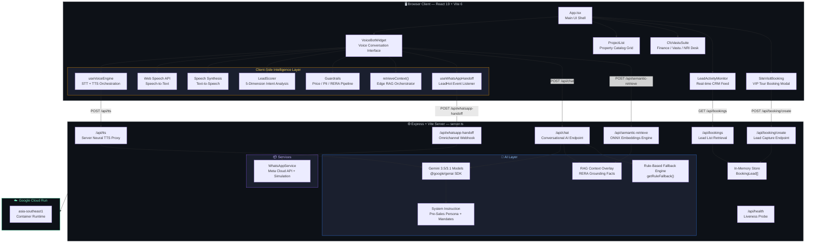

### Component Dependency Graph

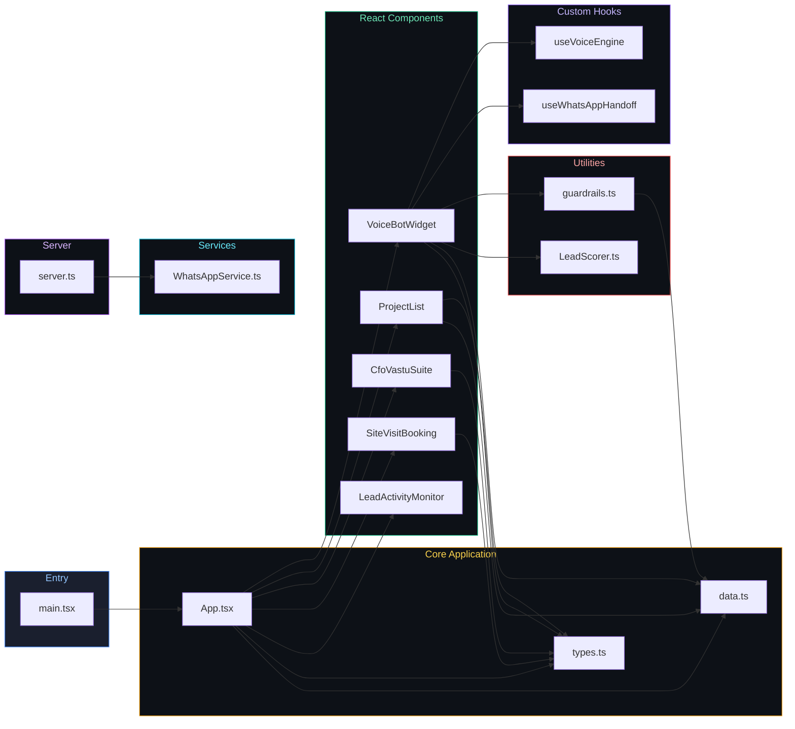

### Deployment Topology

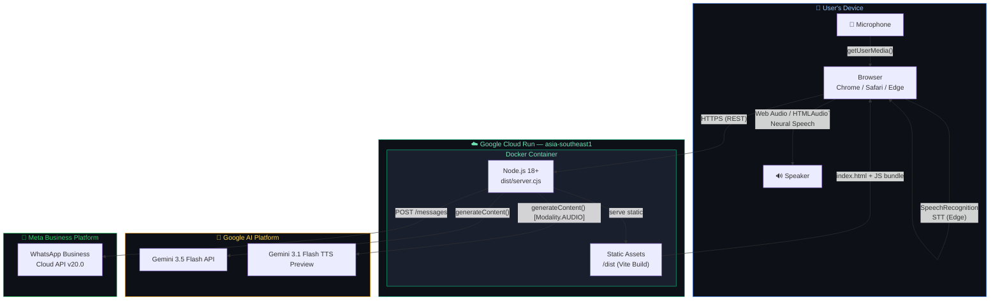

---

## 🎤 Voice Pipeline — End-to-End Flow

The voice pipeline orchestrates the full conversation loop from microphone input to AI-generated spoken response, including edge RAG retrieval, lead scoring, guardrail auditing, and booking intent classification:

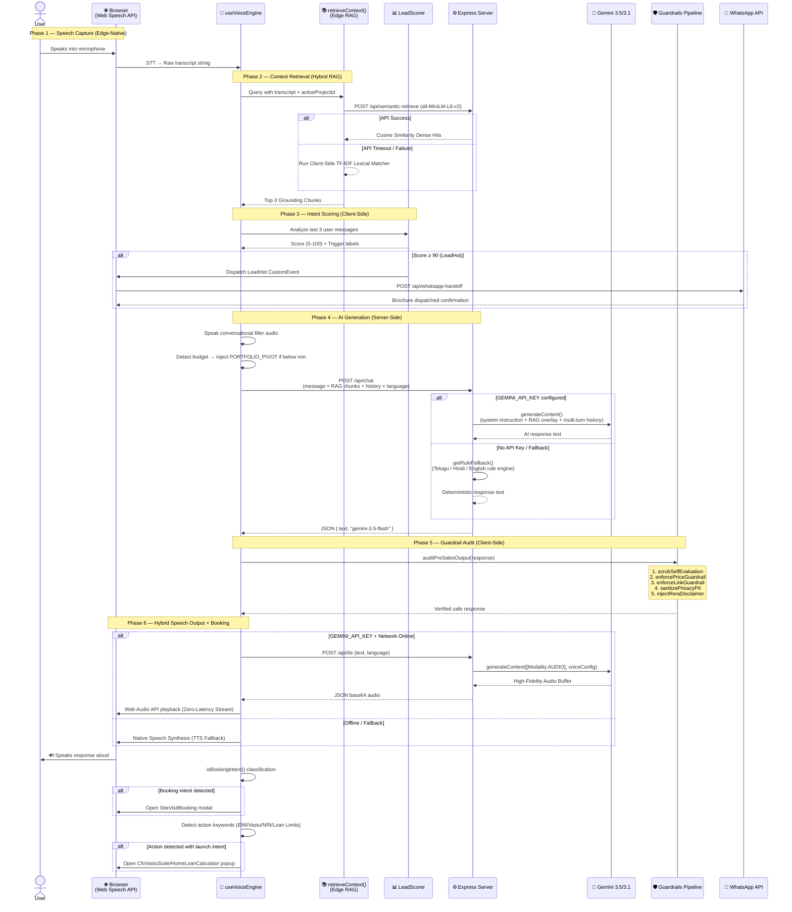

---

## 📚 Edge RAG — Hybrid Context Retrieval Engine

The application features a robust **Hybrid RAG Pipeline** designed for high precision, zero-compromise grounding, and fault tolerance:

1. **Server-Side Semantic Search (Primary):**
   - Utilizes `@xenova/transformers` with the highly optimized **all-MiniLM-L6-v2** sentence-embedding model.
   - Generates 384-dimensional dense vectors in real-time to execute cosine similarity calculations.
   - Features a custom scoring and prioritization engine that boosts relevance for the selected property, penalizes cross-project mentions to prevent context bleeding, and dynamically boosts general guides (Vastu, FEMA, Underwriting) when related topics are queried.

2. **Client-Side Lexical Search (Fallback):**
   - Implemented as a zero-latency TF-IDF (Term Frequency-Inverse Document Frequency) search engine directly inside `src/data.ts`.
   - Tokenizes and filters stop-words, matching terms with a structural 5.0x multiplier on keywords and an 8.0x weighting on property titles.
   - If the server-side API is unavailable or the ONNX model is still loading, it gracefully falls back to this local priority-partitioned algorithm, ensuring continuous RERA-compliant answers.

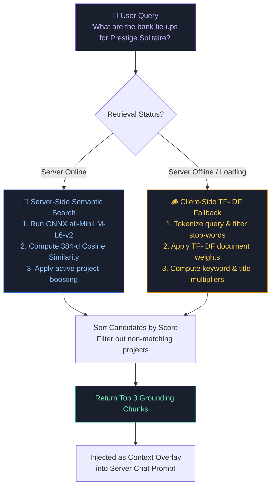

### Grounding and Pre-Approved Properties

To satisfy deep underwriting and pre-sales inquiry bounds, precise RERA and legal configurations are strictly cataloged:
- **Prestige Solitaire:** Pre-approved by **State Bank of India (SBI), HDFC Bank, ICICI Bank, Axis Bank, and LIC Housing Finance** for rapid 5-7 day processing. Standard 80% LTV applies for scores >= 750, with optional joint-borrowing to double tax benefits and expand FOIR allocation up to 60%.
- **DLF Horizon Residences:** Partnered with hyper-premium lenders like **HDFC Wealth Mortgages, SBI Retail Commercial, ICICI Wealth, Axis Wealth, and Standard Chartered**. Offers a preferential **-20 bps APR discount** and a 1.10x borrowing booster for Super Prime Elite credit scores (>= 800).
- **Lodha Splendora Marina:** Connected with **ICICI Bank, SBI, HDFC, Axis, Kotak Mahindra, and Union Bank**. As a completed, ready-to-move-in luxury project with Occupancy Certificates, it enjoys **0% GST requirements**, accelerating capital efficiency and loan disbursement to within 3-5 days.
- **My Home Legend:** Grouped under **SBI Retail, HDFC Capital, ICICI Elite, and Union Bank of India**. Pre-qualified for a **10:90 structural plan under builder subvention programs**, where the developer handles interest-accrual until possession, solving dual rent/EMI loads during current quarters.

### RAG Chunk Categories

| Category | Count | Examples | Key Elements Grounded / Indexed |
|----------|-------|----------|--------------------------------|
| `pricing` | 8 | Unit configs, bank approvals | Variant values, RERA carpet sizes, bank partner tie-ups |
| `rera` | 4 | Registration numbers, compliance | Official IDs, authority status, legal declarations |
| `possession`| 4 | Timeline, construction stage | Phase handovers, structural ready markers, grace periods |
| `location` | 3 | Connectivity, metro, landmarks | Travel distances, local hubs, major highway links |
| `amenities`| 3 | Clubhouse, pool, EV charging | Power backup specs, lifestyle hubs, automated additions |
| `underwriting`| 3 | FOIR, CIBIL scores, LTV limits | **FOIR Caps (50-60%)**, **CIBIL credit bounds & ROI adjustments (-20bps to rejection)**, **LTV 80% caps and downpayment bridging** |
| `general` | 15+ | Vastu, NRI FEMA, stamp duties | NRE/NRO NRO 15CA/CB rules, traditional entrance remediation |

---

## 📊 Lead Scoring Engine

The `LeadScorer` performs real-time buyer intent analysis across **five weighted dimensions** with compounding phrase-level weights. Scores are computed client-side in microseconds on every user utterance:

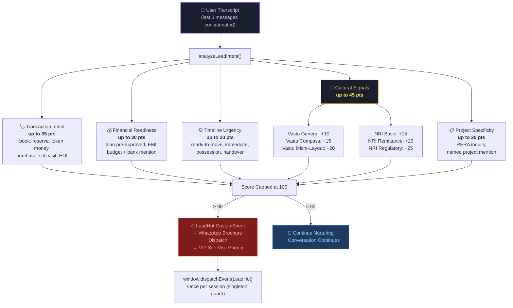

### Scoring Behavior:

- Scores are **compounding** — a user mentioning "book a site visit for the NRI FEMA-compliant east-facing 3BHK" would trigger Transaction + NRI + Vastu + Project dimensions simultaneously.
- The `LeadHot` event fires **exactly once per session** (singleton guard via module-level `leadHotDispatched` flag).
- The scoring function also detects **budget tier** (`Crore-Tier` / `Lakh-Tier`) for analytics segmentation.

---

## 🛡️ Guardrail System

The `auditPreSalesOutput()` pipeline ensures every AI response is RERA-compliant, factually grounded, and privacy-safe before reaching the user. It runs **client-side** as a post-processing filter over conversational returns:

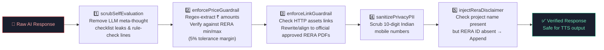

### Guardrail Pipeline Stages

| Guardrail | Detection Method | Action | Module Function |
|-----------|-----------------|--------|-----------------|
| **Self-Eval Scrub** | Regex for LLM checklist/compliance leak patterns (`"3-6 sentences?"`, `"no long numbers?"`) | Strip leaked validation lines | `scrubSelfEvaluationArtifacts()` |
| **Price Verification** | Regex extraction of ₹ amounts → verify against `numericPriceMin`/`numericPriceMax` per unit config with 5% safety buffer | Rewrite to "refer to official RERA price list" | `enforcePriceGuardrail()` |
| **HTTP Link Alignment** | Regex URL search, matches against allowed set of PDFs hosted at `signature-estates.ai` | Align hallucinated URLs to matching correct pre-sales documents | `enforceLinkGuardrail()` |
| **PII Scrubbing** | Regex for 10-digit Indian mobile numbers (`/(?:\+91[\-\s]?)?[789]\d{9}\b/g`) | Replace with `[PHONE NUMBER SCRUBBED FOR PRIVACY]` | `sanitizePrivacyPII()` |
| **RERA Injection** | String matching: project name present but RERA ID absent | Append `(RERA Reg: XXXX)` before final phase marker | `injectReraDisclaimer()` |

---

## 📲 WhatsApp Omnichannel Handoff

When a lead reaches high-commitment status (score ≥ 90), the system automatically triggers a WhatsApp omnichannel handoff through a multi-layer pipeline:

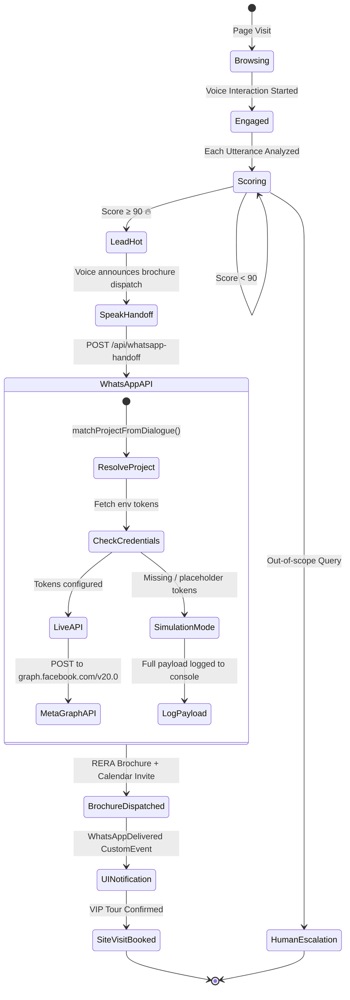

### WhatsApp Service Architecture:

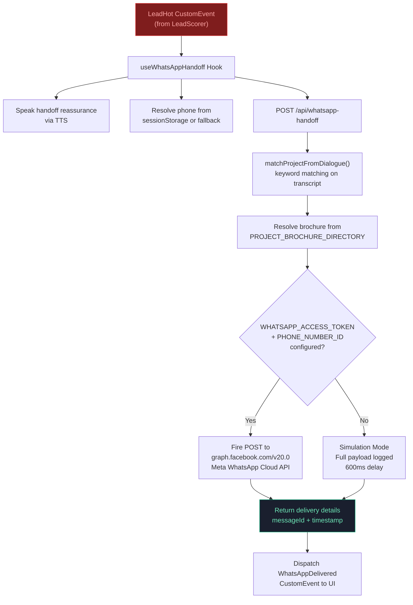

---

## 📐 CFO Finance / Vastu / NRI FEMA Suite

The `CfoVastuSuite` component implements three interactive enterprise decision tools as tabbed configurations:

```mermaid
graph TD
    subgraph FinanceTab["💰 CFO Finance Desk"]
        F1["Select Unit Configuration"] --> F2["Fine-tune Property Value<br/>(range slider)"]
        F2 --> F3["Adjust Downpayment %<br/>Tenure Years<br/>Interest Rate"]
        F3 --> F4["EMI = P × r × (1+r)^n / ((1+r)^n - 1)"]
        F4 --> F5["State-Specific Taxes<br/>Karnataka: 5.1% SD + 1% Reg<br/>Haryana: 7% SD + 1% Reg<br/>Telangana: 5.5% SD + 0.5% Reg<br/>Maharashtra: 6% SD + 1% Reg"]
        F5 --> F6["Section 194-IA<br/>1% TDS if ≥ ₹50L"]
        F6 --> F7["Total Acquisition Estimate"]
    end

    subgraph VastuTab["🧭 Vastu Shastra Engine"]
        V1["Select Entrance Direction<br/>(6 options)"] --> V2["Select Kitchen Placement<br/>(4 options)"]
        V2 --> V3["Compute Vastu Score<br/>(0-100)"]
        V3 --> V4{"Score ≥ 90?"}
        V4 -->|"Yes"| V5["✅ Celestial Alignment Match"]
        V4 -->|"60-89"| V6["⚠️ Compliant Layout"]
        V4 -->|"< 60"| V7["❌ Remediation Required"]
    end

    subgraph NriTab["🌐 NRI FEMA Desk"]
        N1["Toggle NRI Flag"] --> N2["Select Remittance Account<br/>NRE / NRO / Direct Inward"]
        N2 --> N3["FEMA Eligibility Check"]
        N3 --> N4["Repatriation Rules<br/>Max 2 properties<br/>NRO 15CA/15CB forms"]
    end

    style FinanceTab fill:#0d1117,stroke:#3b82f6,color:#93c5fd
    style VastuTab fill:#0d1117,stroke:#f59e0b,color:#fcd34d
    style NriTab fill:#0d1117,stroke:#10b981,color:#6ee7b7
```

---

## 💳 Mortgage Underwriting & Loan Eligibility Desk

The `HomeLoanCalculator` component is a high-performance banking stability calculator designed to solve precise consumer underwriting profiles in real time. It performs multi-variable inverse NPV calculations to establish dynamic lending limits and maps those limitations directly against the four property listings:

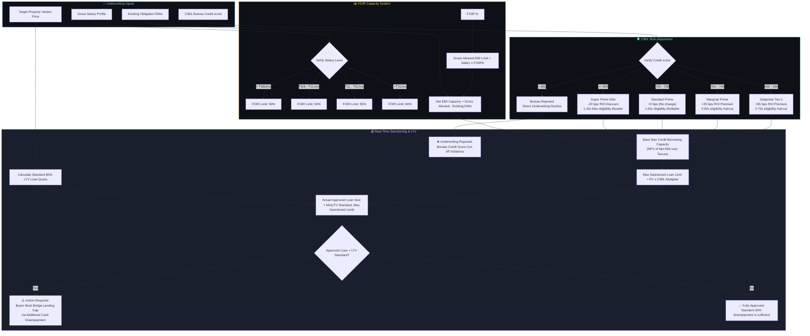

### Core Underwriting Mechanics:
1. **Dynamic Rate Adjustments**: Solves exact retail home loan rates by factoring benchmark bank values (SBI, HDFC, ICICI, LIC) against individual CIBIL score premiums or discounts.
2. **Dynamic Price Variant Selector**: Syncs properties directly and establishes real-time calculations across custom budget sizes and specific configured variants (`3BHK Sky Villa`, `4BHK Presidential Suite`, `Penthouse`).
3. **Cash-flow & Downpayment Advice**: Illustrates structured bridging cash components when the dynamic credit ceiling falls below standard 80% LTV allotments, alerting buyers with exact parameters.
4. **Tier-1 Bank Pricing Matrix**: Directly outputs standard processing charges, effective ROIs, and monthly mortgage EMIs to maximize transactional confidence and remove friction during buyer nurturing.

---

## 🛠️ Tech Stack

| Layer | Technology | Purpose |
|-------|-----------|---------|
| **Frontend** | React 19 + TypeScript | SPA with hooks-based state management |
| **Styling** | Tailwind CSS 4 + Lucide Icons | Utility-first CSS with icon library |
| **Animation**| Motion (Framer Motion) | Message transitions, dynamic entry, layouts |
| **Backend**  | Express 4 + TypeScript (tsx) | API routes + Vite dev middleware integration |
| **AI Models**| Gemini 3.5 Flash & 3.1 TTS | Conversational AI and neural TTS proxies |
| **Voice**    | Web Speech API (native browser) | On-device STT with speech synthesis fallbacks |
| **Embeddings**| `@xenova/transformers` | all-MiniLM-L6-v2 ONNX context encoder |
| **RAG**      | TF-IDF prioritizer (`data.ts`) | Zero-latency keyword lexical client-side fallback |
| **Build**    | Vite 6 + esbuild (server) | Compilation pipeline targeting single `dist/server.cjs` |
| **Deployment**| Google Cloud Run | Serverless container auto-scaling (via `asia-southeast1`) |
| **Linting**  | TypeScript Strict Mode (`tsc`) | Compile-time compliance and type checks |

---

## 📁 Project Structure

```
voice-first-pre-sales-real-estate-ai/
├── server.ts                          # Express backend — AI endpoints, semantic retrieval, and Neural TTS
├── index.html                         # Vite entry HTML
├── package.json                       # Dependencies & build scripts (React 19, Gemini SDK, Express)
├── tsconfig.json                      # TypeScript configuration
├── vite.config.ts                     # Vite bundler config with dynamic HMR block
├── metadata.json                      # Deployment permissions metadata (microphone registration)
├── .env.example                       # Environment variable template
├── .gitignore
├── LICENSE                            # MIT License
│
├── src/
│   ├── main.tsx                       # React entry point
│   ├── App.tsx                        # Main application shell with layout grid, modal controllers
│   ├── index.css                      # Global Tailwind CSS imports
│   ├── types.ts                       # Shared interfaces and core entities definitions
│   ├── data.ts                        # RERA listings + 30+ RAG grounding chunks + lexical retriever
│   │
│   ├── components/
│   │   ├── VoiceBotWidget.tsx         # Voice bot, lead metrics, trigger detection, and language toggles
│   │   ├── ProjectList.tsx            # Property catalog list, dynamic cards, and region filters
│   │   ├── CfoVastuSuite.tsx          # Amortization, RERA taxes, Vastu scorer, and NRI FEMA panels
│   │   ├── HomeLoanCalculator.tsx     # Continuous bank underwriter with credit bureau logic
│   │   ├── SiteVisitBooking.tsx       # Lead registration and date booking panel
│   │   └── LeadActivityMonitor.tsx    # Live CRM telemetry monitoring bookings feed
│   │
│   ├── hooks/
│   │   ├── useVoiceEngine.ts          # Speech synthesis (Hybrid: Server TTS / Web Speech) & barge-in hook
│   │   └── useWhatsAppHandoff.ts      # LeadHot actions interceptor and template dispatcher
│   │
│   ├── utils/
│   │   ├── guardrails.ts             # 5-stage pre-sales regulatory audit engine
│   │   └── LeadScorer.ts             # Multi-variable real-time lead grading compiler
│   │
│   └── services/
│       └── WhatsAppService.ts         # Meta Cloud API courier integration and simulator
│
├── functions/                         # Serverless utility folders
│   └── index.js
│
└── assets/                            # Images and static documents directory
```

---

## 🚀 Getting Started

### Prerequisites
- **Node.js 18+** (LTS recommended)
- A **Gemini API key** from [Google AI Studio](https://aistudio.google.com/) (optional — the app includes local fallsback for offline/unauthenticated running)

### Installation

```bash
# Clone the repository
git clone https://github.com/iammohith/Voice-First-Aura-Real-Estate-Agent-V-FAREA.git
cd Voice-First-Aura-Real-Estate-Agent-V-FAREA

# Install dependencies
npm install

# Set up environment variables
cp .env.example .env
# Edit .env and supply your GEMINI_API_KEY
```

### Running Locally

To initiate development:
```bash
# Launch server-side hotdev
npm run dev
```

For production builds:
```bash
# Compile client and bundle server
npm run build

# Start optimized runtime
npm start
```

The server binds to port `3000` accessible locally at `http://localhost:3000`.

### Environment Variables

| Variable | Required | Description |
|----------|----------|-------------|
| `GEMINI_API_KEY` | Optional | Google Gemini API key. Falls back to offline rules if omitted. |
| `APP_URL` | Optional | The public URL of the deployment (set during Cloud Run setup). |
| `WHATSAPP_ACCESS_TOKEN` | Optional | Permanent Meta Graph Access token for verified delivery. |
| `WHATSAPP_PHONE_NUMBER_ID` | Optional | Business phone number sender identifier on Meta panel. |
| `WHATSAPP_TEMPLATE_NAME` | Optional | Pre-approved templates name (`signature_estates_presales_brochure`). |

---

## 📡 API Reference

### `GET /api/health`
Checks server stability and Gemini credentials.
- **Response:**
  ```json
  { "status": "healthy", "keyConfigured": true }
  ```

---

### `POST /api/chat`
Handles conversing with the pre-sales agent. Encapsulates active language alignment and inserts semantic context chunks.
- **Request:**
  ```json
  {
    "message": "What is the price of 3BHK in My Home Legend?",
    "contextChunks": ["My Home Legend Kokapet: 3BHK Sky Villa ₹2.90 Cr - ₹3.15 Cr..."],
    "history": [
      { "sender": "user", "text": "Hi" },
      { "sender": "assistant", "text": "Welcome! I am Aura..." }
    ],
    "activeLanguage": "en-IN"
  }
  ```
- **Response:**
  ```json
  {
    "text": "My Home Legend in Kokapet offers luxury 3 BHK layouts starting from ₹2.90 Crores.",
    "engine": "gemini-3.5-flash"
  }
  ```

---

### `POST /api/tts`
Synthesizes speech using the neural `gemini-3.1-flash-tts-preview` model for organic, region-specific speaking styles.
- **Request:**
  ```json
  {
    "text": "Your VIP site visit is confirmed.",
    "language": "en-IN"
  }
  ```
- **Response:**
  ```json
  {
    "audio": "SUQzBAAAAAAAI1RTU0UAAAAKAAADTGFtZTMuOThy...",
    "mimeType": "audio/mp3",
    "voiceProfile": "Kore"
  }
  ```

--

### `POST /api/semantic-retrieve`
Queries the ONNX-backed Transformers.js engine utilizing `all-MiniLM-L6-v2` to retrieve similar context chunks.
- **Request:**
  ```json
  {
    "query": "Is there ev charging?",
    "projectId": "dlf-horizon"
  }
  ```
- **Response:**
  ```json
  {
    "results": [
      "DLF Horizon Sector 65 Gurugram features fully-wired ultra-rapid EV charging docks (rera-pricing-guide).",
      "All projects come with active power grids for electrical vehicle components (rera-amenities-guide)."
    ],
    "useFallback": false
  }
  ```

---

### `POST /api/booking/create`
Saves and schedules a VIP physical visit.
- **Request:**
  ```json
  {
    "name": "Anand Murthy",
    "phone": "9845012345",
    "email": "anand@outlook.in",
    "projectId": "myhome-legend",
    "projectName": "My Home Legend",
    "preferredDate": "2026-06-07",
    "preferredTime": "10:00 AM - 12:00 PM"
  }
  ```
- **Response:**
  ```json
  {
    "success": true,
    "booking": { "id": "book_1717100000000", "name": "Anand Murthy", "..." },
    "message": "VIP booking captured."
  }
  ```

---

### `GET /api/bookings`
Extracts stored CRM lead records.
- **Response:**
  ```json
  { "bookings": [...] }
  ```

---

### `POST /api/whatsapp-handoff`
Pushes RERA brochures and scheduling invites to Meta Cloud APIs (or simulation).
- **Request:**
  ```json
  {
    "score": 95,
    "triggers": ["DIRECT_TRANSACTION_INTENT"],
    "transcript": "Book me a tour for legend",
    "budgetDetected": "Crore-Tier",
    "phone": "919845012345"
  }
  ```
- **Response:**
  ```json
  {
    "success": true,
    "dispatched": true,
    "deliveryDetails": {
      "timestamp": "2026-06-03T16:05:58Z",
      "phoneNumber": "919845012345",
      "mediaLink": "https://signature-estates.ai/docs/my-home-legend-brochure.pdf"
    }
  }
  ```

---

## 🌐 Supported Languages

The voice bot supports multilingual conversations with automatic language detection and matching TTS voice selection:

| Language | Code | STT | TTS (Neural) | TTS (Local Edge) | AI Response | Rule Fallback | Voice Profile |
|----------|------|-----|--------------|------------------|-------------|---------------|---------------|
| English | `en-IN` | ✅ | ✅ | ✅ | ✅ | ✅ Full | `Kore` |
| Hindi (हिन्दी) | `hi-IN` | ✅ | ✅ | ✅ | ✅ | ✅ Full | `Kore` |
| Telugu (తెలుగు) | `te-IN` | ✅ | ✅ | ✅ | ✅ | ✅ Full | `Zephyr` |
| Tamil (தமிழ்) | `ta-IN` | ✅ | ✅ | ✅ | ✅ | ⚠️ Partial | `Zephyr` |
| Marathi (మరాठी) | `mr-IN` | ✅ | ✅ | ✅ | ✅ | ⚠️ Partial | `Puck` |
| Bengali (বাংলা) | `bn-IN` | ✅ | ✅ | ✅ | ⚠️ | ⚠️ Partial | `Puck` |
| Kannada (ಕನ್ನಡ) | `kn-IN` | ✅ | ✅ | ✅ | ⚠️ | 🔜 Planned | `Charon` |
| Gujarati (ગુજરાતી) | `gu-IN` | ✅ | ✅ | ✅ | ⚠️ | 🔜 Planned | `Fenrir` |
| Malayalam (മലയാളం) | `ml-IN` | ✅ | ✅ | ✅ | ⚠️ | 🔜 Planned | `Charon` |

---

## 🏗️ Featured Properties

The platform showcases four RERA-approved premium developments with complete grounding data:

| Property | Developer | Location | Price Range | RERA ID | Possession |
|----------|-----------|----------|-------------|---------|------------|
| **Prestige Solitaire** | Prestige Group | Whitefield, Bengaluru | ₹1.45 Cr – ₹3.40 Cr | PRM/KA/RERA/1251/... | Dec 2028 |
| **DLF Horizon** | DLF Group | Sector 65, Gurugram | ₹3.80 Cr – ₹9.00 Cr | RC/REP/HARERA/GGM/... | Oct 2029 |
| **Lodha Splendora Marina** | Lodha Group | Thane West, Mumbai | ₹85 L – ₹2.10 Cr | P51700021432 | Ready to Move |
| **My Home Legend** | My Home Constructions | Kokapet, Hyderabad | ₹2.90 Cr – ₹8.30 Cr | P02400007821 | Mar 2029 |

---

## 🧩 Design Decisions & Trade-offs

### Why Edge RAG instead of a Vector Database?
The knowledge base is curated and bounded (4 properties × 6 categories + 15 general chunks). A local keyword-scoring approach alongside an optional, embedded ONNX vector similarity engine (`all-MiniLM-L6-v2` loaded locally inside Node.js memory) delivers **ultra-fast retrieval times** with zero external database dependencies. This ensures that the voice widget responds inside the critical threshold, trading massive dimensional scaling for reliable on-premise performance.

### Why Client-Side Guardrails?
Running guardrails on the client ensures the pipeline works identically in both Gemini and fallback modes. It also prevents RERA-violating content from ever reaching TTS — even if the server returns a problematic response due to prompt injection or model drift.

### Why Browser-Native STT instead of Cloud ASR?
Using the browser-native `SpeechRecognition` API handles on-device sound capture and decoding locally. It avoids the latency associated with streaming high-rate PCM bytes over networks and maintains extreme privacy standards under regional data acts.

### Why Dual-Engine Architecture?
The rule-based fallback engine (`getRuleFallback()`) ensures the application is **fully functional without any API key**, which is critical for:
1. Offline demo scenarios at hackathons
2. CI/CD pipeline testing
3. Rate-limited or quota-exhausted API keys

---

## 📄 License

This project is licensed under the [MIT License](LICENSE).

---

<p align="center">
  Built with ❤️ by <strong>Mohith Sai Gorla</strong> at <strong>Agentic Premier League by Google, Hyderabad</strong><br/>
  Powered by <strong>Gemini 3.5 Flash</strong> &amp; <strong>Google AI SDK</strong>
</p>
